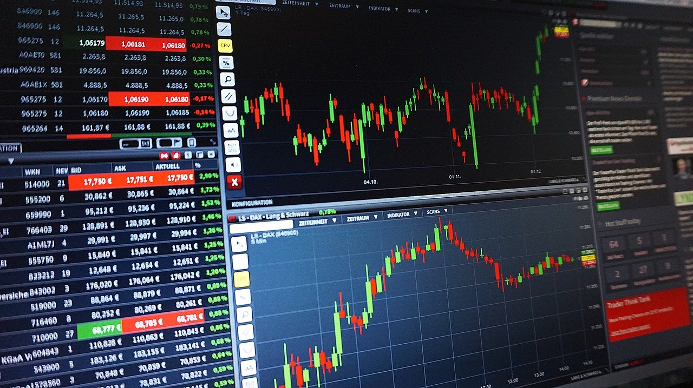

# DJIA_analysis

## Background

The Dow Jones Industrial Average is a widely used market benchmark with 30 stock components in it. It tracks some of America’s largest companies. 

Various analyses can be done to understand risks associated with each individual stock. The variability between each stock and the industrial average in determined. Some measures are covariance, beta, or correlation coefficient. Based on them, we can also determine the systematic and unsystematic risk of the individual stock.

Note:- More analyses will be added soon to include CAPM, bankruptcy risk, as well as portfolio construction. Other aspects such as profitability, liquidity, and other performance measures will be included soon.

The end goal is to deploy a webapp on Heroku with visualizations of various components in the analysis.

### Requirements:
* IEX API Token (https://iexcloud.io/) as ‘api_token’
* Create API Token and store it in a ‘config.py’ file before running the Jupyter notebook.

